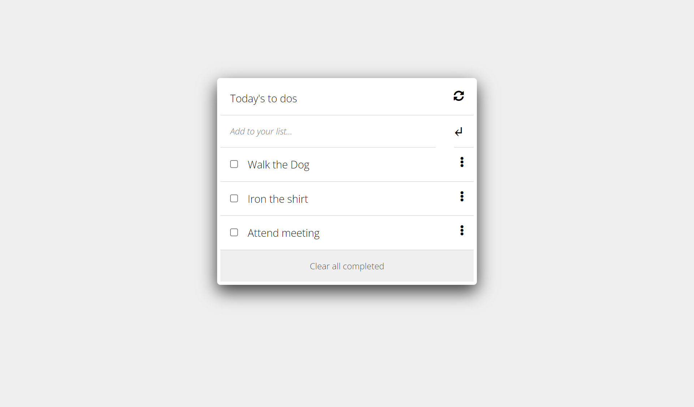

# To Do List Application

> A simple to do list application made with Html, CSS, JavaScript.

## Built With

 HTML, CSS & JS
- Webpack FontAwesome
- Github

## Live Demo (if available)

[Live Demo Link](https://livedemo.com)

## Getting Started

To get a local copy up and running follow these simple example steps.

### Prerequisites
Install Webpack package bundler.

### Setup
Clone this link [repo](https://github.com/sumairq/to-do-list.git) to setup the repository.

### Install
run the following commands:
npm install webpack webpack-cli --save-dev
npm install --save-dev html-webpack-plugin
npm install --save-dev style-loader css-loader
npm install --save-dev webpack-dev-server

### Usage
Use the following commands to spin up the project.  
npm run start

### Run tests

### Deployment

[Deployment] (https://sumairq.github.io/Todo-List-Microverse/)

## Authors

👤 **Sumair Qaisar Jadoon**

- GitHub: [@sumairq](https://github.com/sumairq)
- Twitter: [@sumair_qaisar](https://twitter.com/sumair_qaisar)
- LinkedIn: [LinkedIn](https://linkedin.com/in/sumair-qaisar-jadoon-84a877164)

## 🤝 Contributing

Contributions, issues, and feature requests are welcome!

Feel free to check the [issues page](../../issues/).

## Show your support

Give a ⭐️ if you like this project!

## Acknowledgments

- For this project I followed the Minimalist design for to do list, that is not existing anymore,
This is the demo for the Todo List [Minimalist](https://www.youtube.com/watch?v=AcUd-_Yjjqg)

## 📝 License

This project is [MIT](./MIT.md) licensed.
